# agent-vault-proxy

**Just-in-time API keys for AI agents and any other process you route through it: the caller only ever sees a placeholder.**

AVP protects you from credential stealers (Shai-Hulud and similar) and prompt-injected agents leaking your secrets. It's a local proxy that injects real secrets into requests in-flight, so a compromised or prompt-injected agent has nothing to steal.

[](https://pypi.org/project/agent-vault-proxy/)
[](./LICENSE)
[](https://github.com/inflightsec/agent-vault-proxy/actions/workflows/test.yml)



Under the hood: a loopback HTTPS proxy that fetches credentials from [Bitwarden Secrets Manager](https://github.com/bitwarden) — cloud or self-hosted — just-in-time and injects them into outbound requests, so the calling process never holds the real credential bytes in its address space.

## Try it. 10 seconds.

```bash
$ pipx install agent-vault-proxy            # pipx puts `avp` on $PATH for sudo
$ sudo avp setup --static
$ sudo avp secret add STRIPE_API_KEY         # prompts; no echo
✓ added secret 'STRIPE_API_KEY'
  next: run `avp env` to refresh ~/.config/avp/env
$ avp env
$ avp run claude                             # auto-loads ~/.config/avp/env, sets proxy, exec
```

`avp run` reads the placeholder env file itself, so the real key never enters your shell — not even as a placeholder. Add more secrets later by repeating `secret add` + `avp env`.

No Bitwarden account? `--static` keeps secrets in a local YAML file owned by the service user. Upgrade later by re-running `sudo avp setup` without `--static`.

On Mac: `brew install inflightsec/avp/agent-vault-proxy`.

## See it in action

[](docs/demo.cast)

## Add a secret with your AI agent — no config editing

Onboarding a new brokered credential shouldn't mean hand-writing binding YAML. The bundled **[avp-bindings skill](skills/avp-bindings/)** lets an AI assistant (Claude Code, or any agent that loads skills) walk you through it: you say *"route the Acme API through AVP,"* it asks the auth shape and host, then tells you **exactly** what to add — the secret name plus the annotation to paste into the **Bitwarden Secrets Manager Notes field** (or the **Google Secret Manager `avp-binding` annotation**, or a future backend's per-secret metadata). No AVP config edit, no redeploy — and the assistant **never sees or stores the secret**; it proposes, you apply.

### Install the skill

**Claude Code (recommended)** — install it as a plugin, so it's available in every project and updates with `/plugin marketplace update`:

```
/plugin marketplace add inflightsec/agent-vault-proxy
/plugin install avp@agent-vault-proxy
```

Invoke it as `/avp:avp-bindings`, or just say *"route the Acme API through AVP"* and it triggers on its own.

**Manual (any agent that loads Anthropic-format skills)** — copy or symlink `skills/avp-bindings/` into your agent's skills directory; Claude Code reads `~/.claude/skills/`. A symlink keeps it current on `git pull`:

```
ln -s "$PWD/skills/avp-bindings" ~/.claude/skills/avp-bindings
```

## Docs

- **[Is AVP for you?](docs/is-it-for-you.md)** — what it does, what it deliberately does not do, why, and when to reach for it (start here if you're evaluating)
- **[Quickstart](docs/quickstart.md)** — 10-minute first run ending in a visible substitution
- **[Concepts](docs/concepts.md)** — placeholder, binding, the CA, fail-closed — in plain terms
- **[Prerequisites](docs/prerequisites.md)** — Bitwarden Secrets Manager setup (do this first)
- **[Linux install](docs/install-systemd.md)** · **[Docker](docs/docker.md)** · **[macOS](https://github.com/inflightsec/homebrew-avp)**
- **[Usage](docs/usage.md)** — pointing your agent at the proxy
- **[Linux isolation](docs/linux-isolation.md)** — composing AVP with `bubblewrap` for filesystem sandboxing
- **[bindings.example.yaml](bindings.example.yaml)** — full config schema
- **[avp-bindings skill](skills/avp-bindings/)** — let an AI assistant author your notes/annotation bindings (propose-only, no config edit, no redeploy)
- **[Architecture](docs/architecture.md)** — threat model, G1–G9 invariants, hardening, residual risks
- **[Adapter architecture](docs/adapter-architecture.md)** — vault backends (Bitwarden + Google Secret Manager ship today, `static` for dev) and how to add another
- **[Google Secret Manager](docs/gcp-secret-manager.md)** — keep secrets in GSM: setup, keyless auth, and end-to-end testing
- **[Comparison](docs/comparison.md)** — vs. Vault Agent, Doppler, `op run`, `superfly/tokenizer`
- **[CHANGELOG](./CHANGELOG.md)** · **[SECURITY](./SECURITY.md)** · **[CONTRIBUTING](./CONTRIBUTING.md)** · **[CREDITS](./CREDITS.md)**

The proxy never phones home. The only outbound connections it makes are to the BWS endpoint you configure and the upstream APIs your agent is calling. No telemetry. The audit log under `/var/log/agent-vault-proxy/audit.jsonl` is local-only by default; optional [off-box shipping](docs/adrs/ADR-0019-off-box-audit-shipping.md) forwards it — from a separate sidecar, never the proxy — only to a collector you run and control.

## License

MIT — see [LICENSE](LICENSE). Prior art acknowledged in [`CREDITS.md`](./CREDITS.md).
