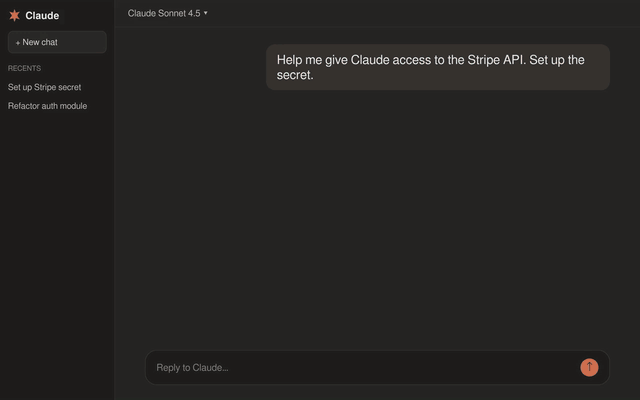

# Keys on the Wire

**Your AI agent never holds your API keys. It sends a placeholder; the real secret is swapped in on the wire.**

Stops credential stealers (Shai-Hulud and similar) and prompt-injected agents from leaking your secrets. A compromised agent has nothing to take.

[](https://pypi.org/project/keys-on-the-wire/)
[](./LICENSE)
[](https://github.com/inflightsec/keys-on-the-wire/actions/workflows/test.yml)

Ask your agent to set up a secret, paste one line into your vault, and you are done. Same view across macOS Keychain, Bitwarden, Google Secret Manager, and AWS:



## How it works

1. Your agent sends a request with a *placeholder*, not the key.
2. Keys on the Wire swaps in the real secret from your vault, in transit.
3. The agent never sees the key. Nothing to leak, nothing to steal.


Under the hood it's a loopback HTTPS proxy. It fetches each credential from your vault just in time and injects it into the outbound request, so the calling process (your agent, or anything else you route through it) never holds the real bytes.

## Features

- **Any REST or HTTPS API.** A loopback HTTPS proxy: route any agent, app or script through it and kow injects the key into the outbound request.
- **Every auth scheme.** Bearer, `token`, X-API-Key, Basic, plus OAuth2 refresh and client-credentials, JWT bearer, GitHub App, HMAC and AWS SigV4 - with presets for Google, Microsoft, Auth0, Slack, Atlassian and Okta.
- **Your vault, not ours.** macOS Keychain, Bitwarden Secrets Manager, Google Secret Manager, AWS Secrets Manager, or a local `static` file for trying it out. See [Adapter architecture](docs/adapter-architecture.md).
- **Scoped and fail-closed.** Bind a key to specific `methods:` and `paths:`. A denied destination gets a 403, or the placeholder forwarded verbatim, never the real key. Every injection lands in an append-only audit log.
- **Broker MCP servers.** `kow mcp install` swaps a standing MCP token for a placeholder and routes that server's egress through the proxy.
- **Open source, no lock-in.** Apache-2.0, no hosted tier, no telemetry. The proxy never phones home.

## Install

**1. Install** (Linux `pipx`, macOS `brew`):

```bash
pipx install 'keys-on-the-wire[bitwarden]'
# or if you are on macOS:
brew install inflightsec/keys-on-the-wire/keys-on-the-wire
# Then set it up with bws, keychain, gsm or asm
sudo kow setup --bws
```

**2. Broker a service from any agent.** Paste this to Claude Code, Codex, Cursor, or a bare terminal agent:

```
Read https://github.com/inflightsec/keys-on-the-wire#install and set up kow for me.
```

The agent mints the placeholder and prints the exact note to paste into your vault. It never sees your key. Prefer a Claude Code plugin? Install the [bundled skill](skills/kow/) instead:

```
/plugin marketplace add inflightsec/keys-on-the-wire
/plugin install kow@keys-on-the-wire
```

**3. Add the real key** to your vault with that note, then route your agent through the proxy:

```bash
kow env && kow run claude
```

Done. The agent only ever sends the placeholder; Keys on the Wire swaps in the real key on the wire.

New to this? The [Quickstart guide](docs/quickstart.md) walks the first run in full, and [Prerequisites](docs/prerequisites.md) covers vault setup. Prefer shell env vars over `kow run`? See [Usage](docs/usage.md).

## Before you point it at production keys

- **Trial it behind one process.** `kow run -- <command>` sets the proxy and CA variables in that process only; your login shell never inherits them. [Scoping to a single process](docs/single-process.md).
- **Fail-closed is the only mode.** If kow is down, routed calls fail rather than proceeding without credentials. A denied destination gets a 403, or the placeholder forwarded verbatim; the real key is never sent.
- **It stops theft, not misuse.** kow takes the key out of the agent's context; it does not judge why an API is being called. Narrowing a binding with `methods:` and `paths:` is the lever, and it is enforced. [Is it for you?](docs/is-it-for-you.md) draws the full boundary.

## Broker an MCP server

Each MCP server keeps a long-lived token in cleartext in your client config, readable by every other server the client loads. `kow mcp install` swaps that standing secret for a placeholder and routes the server's egress through the proxy:

```
kow mcp install github --host api.github.com --env-var GITHUB_PERSONAL_ACCESS_TOKEN \
  --server-cmd "npx -y @modelcontextprotocol/server-github"
```

It prints the vault note and the exact `claude mcp add --env` command. Design and threat model: [ADR-0040](docs/adrs/ADR-0040-mcp-server-credential-broker.md).

## The binding is one line

Onboarding a credential is not hand-written YAML. The bundled [kow skill](skills/kow/) asks the auth shape and host, then tells you exactly what to paste into your secret's Notes field:

```
# kow-binding
api.acme.com
```

That marker line is what makes it a binding; without it the note stays a plain human description, never parsed ([ADR-0025](docs/adrs/ADR-0025-notes-binding-marker.md)). The assistant proposes, you apply. It never sees or stores the secret.

## Watch it stop an attack

The desktop walkthrough up top is the fast path. If you'd rather watch it defend against a prompt injection in the terminal, this is the same flow as an asciinema recording: a prompt-injected agent tries to read the key and gets only the placeholder:

[](docs/demo.cast)

## Docs

**Start here**: [Is it for you?](docs/is-it-for-you.md) if you're evaluating · [Prerequisites](docs/prerequisites.md) to set up your vault · [Quickstart](docs/quickstart.md) for a 10-minute first run.

**Understand**: [Concepts](docs/concepts.md) for placeholder, binding, CA and fail-closed in plain terms · [Architecture](docs/architecture.md) for the threat model, the G1 to G9 invariants and residual risks.

**Install and operate**: [Linux](docs/install-systemd.md) · [Docker](docs/docker.md) · [macOS](https://github.com/inflightsec/homebrew-keys-on-the-wire) · [Usage](docs/usage.md) · [Single process](docs/single-process.md) · [Linux isolation](docs/linux-isolation.md) · [macOS isolation](docs/macos-isolation.md) · [Google Secret Manager](docs/gcp-secret-manager.md)

**Reference**: [bindings.example.yaml](bindings.example.yaml) is the full config schema · [Adapter architecture](docs/adapter-architecture.md) for vault backends and how to add one · [Comparison](docs/comparison.md) versus Vault Agent, Doppler, `op run` and others · [CHANGELOG](./CHANGELOG.md) · [SECURITY](./SECURITY.md) · [CONTRIBUTING](./CONTRIBUTING.md) · [CREDITS](./CREDITS.md)

## Open source, no lock-in

Every feature is in this repo under Apache-2.0. There is no paywalled tier, no hosted service, and no telemetry. The proxy never phones home: its only outbound connections are your vault and the upstream APIs your agent calls. If an [alternative](docs/comparison.md) fits your setup better, use that.

One optional dependency is not open source, the Bitwarden backend's [`bitwarden-sdk`](https://pypi.org/project/bitwarden-sdk/), which you install only if you use that backend. See [LICENSE](LICENSE) and [NOTICE](NOTICE).
